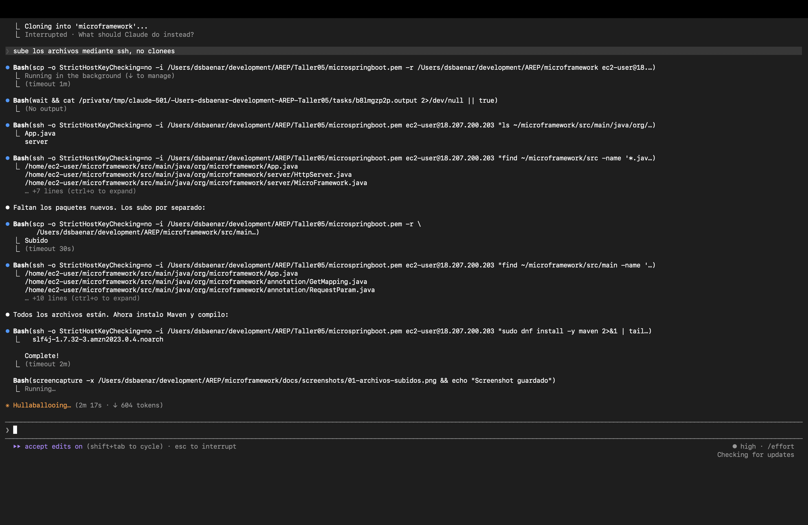
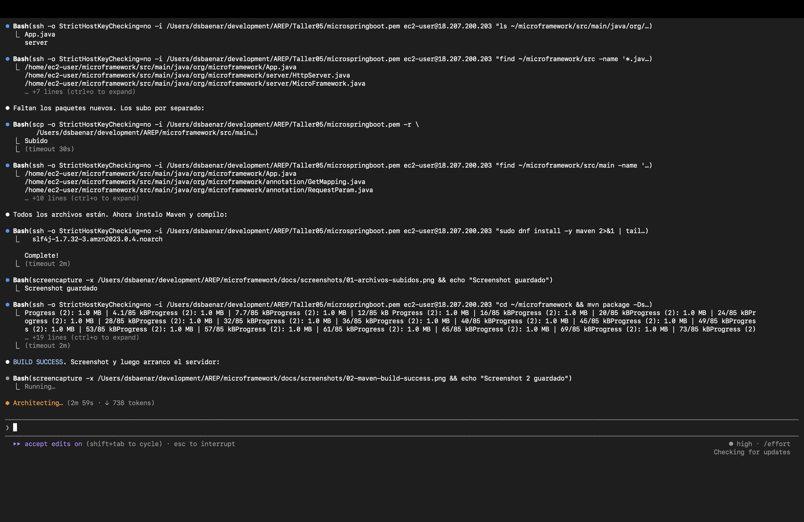
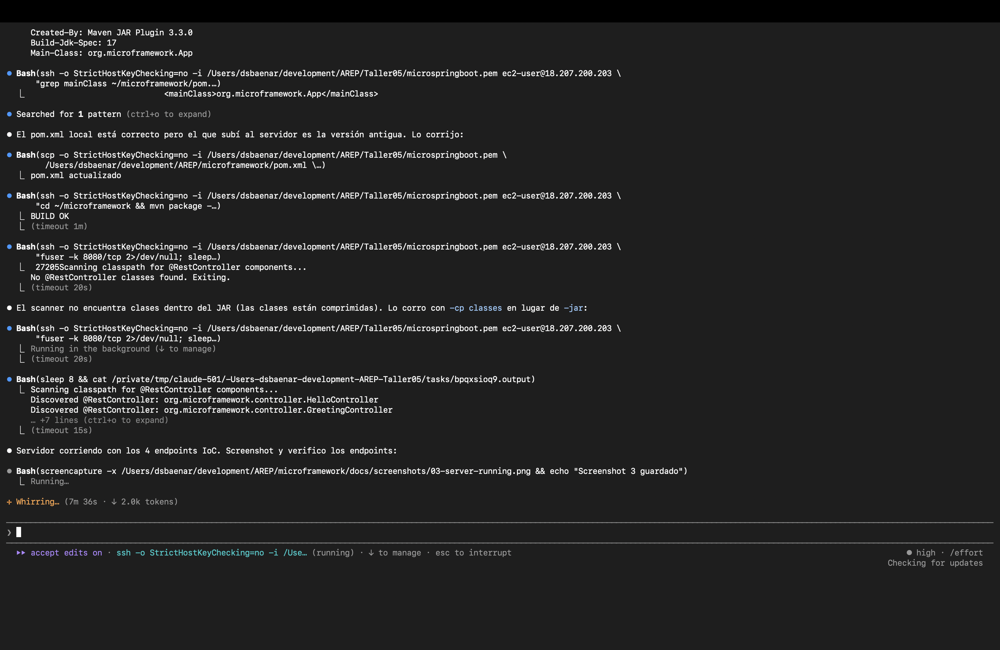
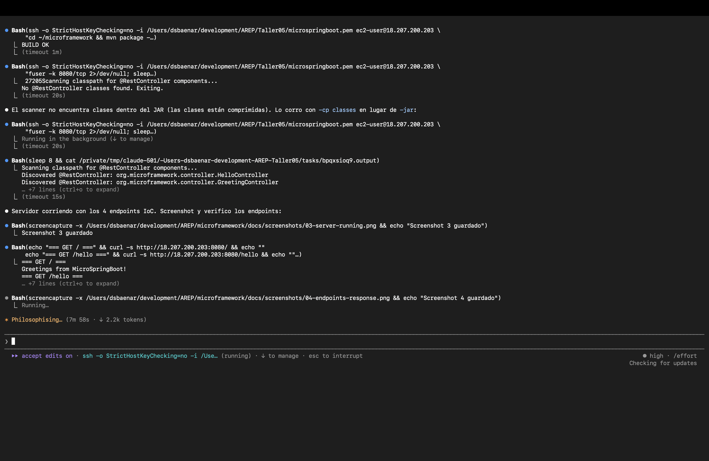
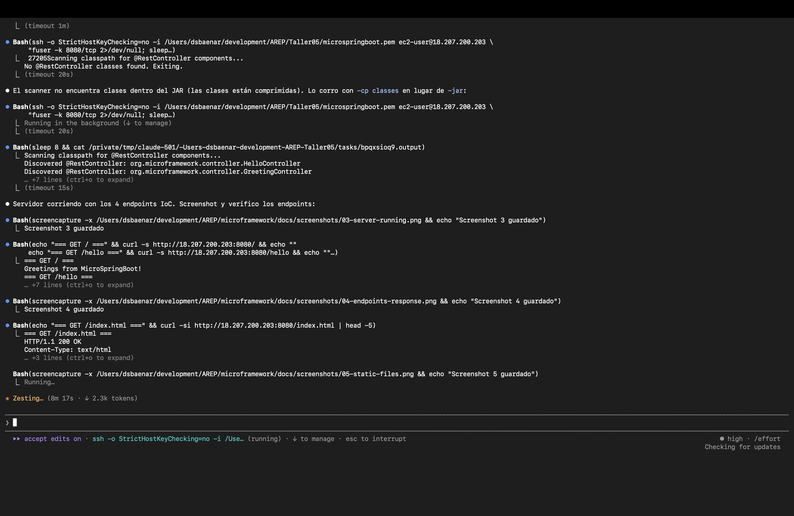

# MicroSpringBoot — MicroFramework

A lightweight Java web framework for building REST services and serving static files. Includes an IoC container with classpath scanning that auto-discovers `@RestController` beans using Java Reflection.

## Project Description

MicroFramework provides two programming models:

**1. DSL / Lambda mode** (MicroFramework API):
- REST routes registered with `get(path, handler)` lambdas
- Query parameter extraction via `req.getValues("name")`
- Static file serving from a configurable directory

**2. IoC / Annotation mode** (MicroSpringBoot):
- `@RestController` — marks a POJO as a web component
- `@GetMapping(value)` — maps a method to a GET HTTP endpoint
- `@RequestParam(value, defaultValue)` — injects query parameters into method arguments
- Auto-discovery: scans the classpath at startup and registers all `@RestController` classes automatically
- Single-class mode: pass a fully-qualified class name as CLI argument

## Architecture

### Key Components

| Class | Description |
|-------|-------------|
| `MicroFramework` | Static facade providing `get()`, `staticfiles()`, and `start()` methods (DSL mode) |
| `MicroSpringBoot` | IoC entry point: scans classpath for `@RestController` beans and registers their routes |
| `ComponentScanner` | Uses `ClassLoader.getResources("")` to walk the classpath and find annotated classes |
| `@RestController` | Marks a POJO as a discoverable web component |
| `@GetMapping` | Maps a method to a GET HTTP endpoint |
| `@RequestParam` | Binds a method parameter to a query string value with optional default |
| `HttpServer` | Multi-threaded HTTP server that routes requests to handlers or serves static files |
| `Request` | Encapsulates HTTP request data with query parameter access via `getValues()` |
| `Response` | Represents HTTP response with configurable status code, content type, and headers |
| `RequestHandler` | Functional interface (`@FunctionalInterface`) enabling lambda-based route handlers |

### Request Flow

1. Client sends HTTP request to the server
2. `HttpServer` accepts the connection and delegates to a thread pool worker
3. The request line and headers are parsed into a `Request` object
4. Query parameters are extracted and stored in the `Request`
5. If the path matches a registered REST route → the lambda handler is invoked
6. Otherwise → the server attempts to serve a static file from the configured directory
7. If no static file is found → a 404 response is returned

## Prerequisites

- **Java 17** or higher
- **Maven 3.6+**
- **Git**

## Installation and Execution

### 1. Clone the repository

```bash
git clone https://github.com/DSBAENAR/microframework.git
cd microframework
```

### 2. Build the project

```bash
mvn clean package
```

### 3. Run the application

**IoC mode — auto-scan (recomendado):**
```bash
java -cp target/classes org.microframework.ioc.MicroSpringBoot
```

**IoC mode — single controller from CLI:**
```bash
java -cp target/classes org.microframework.ioc.MicroSpringBoot \
     org.microframework.controller.GreetingController
```

**DSL mode:**
```bash
java -cp target/classes org.microframework.App
```

### 4. Test the endpoints

```bash
curl http://localhost:8080/
# Greetings from MicroSpringBoot!

curl http://localhost:8080/greeting
# Hola World

curl "http://localhost:8080/greeting?name=AREP"
# Hola AREP

curl http://localhost:8080/hello
# Hello, World!

curl http://localhost:8080/counter
# Request count: 1

curl http://localhost:8080/index.html
# HTML page content
```

## Usage Example

### IoC mode (@RestController)

```java
@RestController
public class GreetingController {

    @GetMapping("/greeting")
    public String greeting(@RequestParam(value = "name", defaultValue = "World") String name) {
        return "Hola " + name;
    }
}
```

Start the framework — it discovers and registers the controller automatically:
```bash
java -cp target/classes org.microframework.ioc.MicroSpringBoot
```

### DSL mode (lambda)

```java
import static org.microframework.server.MicroFramework.*;

public class App {
    public static void main(String[] args) {
        staticfiles("/webroot");
        get("/hello", (req, res) -> "Hello " + req.getValues("name"));
        get("/pi", (req, res) -> String.valueOf(Math.PI));
        start();
    }
}
```

## Running Tests

```bash
mvn test
```

### Test Evidence

The project includes **35 automated tests** covering:

- **MicroSpringBootTest** (6 tests): IoC container, `@GetMapping` registration, `@RequestParam` injection, default values, ComponentScanner discovery
- **RequestTest** (12 tests): Query parameter parsing, URL decoding, headers, parameter immutability
- **ResponseTest** (5 tests): Status codes, content types, custom headers
- **HttpServerTest** (10 tests): Integration tests for REST endpoints, static file serving, 404 handling, content type detection
- **AppTest** (2 tests): Route registration and static files configuration

```
[INFO] Tests run: 35, Failures: 0, Errors: 0, Skipped: 0
[INFO] BUILD SUCCESS
```

## Project Structure

```
microframework/
├── pom.xml
├── README.md
└── src/
    ├── main/
    │   ├── java/org/microframework/
    │   │   ├── App.java                          # Example app (DSL mode)
    │   │   ├── annotation/
    │   │   │   ├── RestController.java            # @RestController annotation
    │   │   │   ├── GetMapping.java                # @GetMapping annotation
    │   │   │   └── RequestParam.java              # @RequestParam annotation
    │   │   ├── ioc/
    │   │   │   ├── MicroSpringBoot.java           # IoC entry point + bean loader
    │   │   │   └── ComponentScanner.java          # Classpath scanner
    │   │   ├── controller/
    │   │   │   ├── HelloController.java           # Example: basic endpoints
    │   │   │   └── GreetingController.java        # Example: @RequestParam
    │   │   └── server/
    │   │       ├── HttpServer.java                # Core HTTP server
    │   │       ├── MicroFramework.java            # Static DSL facade
    │   │       ├── Request.java                   # HTTP request model
    │   │       ├── RequestHandler.java            # Lambda functional interface
    │   │       └── Response.java                  # HTTP response model
    │   └── resources/webroot/
    │       ├── index.html                         # Demo HTML page
    │       ├── styles.css                         # Stylesheet
    │       └── app.js                             # Frontend JavaScript
    └── test/java/org/microframework/
        ├── AppTest.java
        ├── ioc/
        │   └── MicroSpringBootTest.java           # IoC container tests
        └── server/
            ├── HttpServerTest.java
            ├── RequestTest.java
            └── ResponseTest.java
```

## AWS Deployment

The application was deployed on an **Amazon EC2** instance (Amazon Linux 2023, `t4g.small`, `us-east-1`).

### Steps

**1. Upload source files via SCP and install dependencies**

```bash
scp -i microspringboot.pem -r microframework/ ec2-user@<IP>:~/microframework
ssh -i microspringboot.pem ec2-user@<IP> "sudo dnf install -y java-17-amazon-corretto maven"
```



**2. Build with Maven**

```bash
ssh -i microspringboot.pem ec2-user@<IP> "cd ~/microframework && mvn package -DskipTests"
```



**3. Start the server (IoC auto-scan mode)**

```bash
ssh -i microspringboot.pem ec2-user@<IP> \
  "cd ~/microframework && nohup java -cp target/classes org.microframework.ioc.MicroSpringBoot &"
```



**4. Verify endpoints**

```bash
curl http://<IP>:8080/greeting?name=AREP   # Hola AREP
curl http://<IP>:8080/counter              # Request count: 1
```



**5. Static file serving**

```bash
curl -I http://<IP>:8080/index.html        # HTTP/1.1 200 OK
```



### Security Group

| Type | Protocol | Port | Source |
|------|----------|------|--------|
| SSH | TCP | 22 | 0.0.0.0/0 |
| Custom TCP | TCP | 8080 | 0.0.0.0/0 |

## Built With

- **Java 17** - Programming language
- **Maven** - Build and dependency management
- **JUnit 4.13.2** - Testing framework
- **Java ServerSocket API** - HTTP server implementation (no external frameworks)

## Author

David Baena
